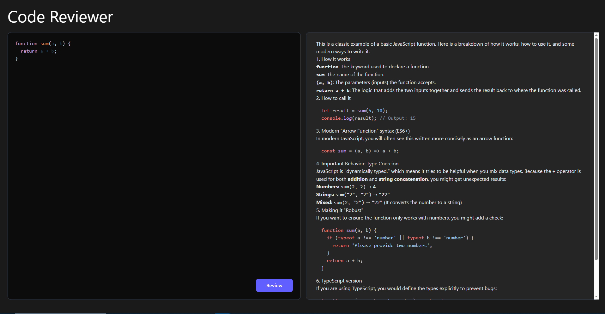

# 🚀 AI Code Reviewer

A powerful, full-stack MERN application that leverages **Google's Gemini 3 Flash Preview** to provide instant, senior-level code reviews. Built for developers who want deep architectural insights and clean code suggestions at the click of a button.



## 💡 Why this project?

In 2026, "Vibe Coding" and AI-assisted development are the standards. This project utilizes the **Gemini 3 Flash** "Thinking Mode" to go beyond simple syntax checking—it analyzes logic, security, and performance.

## ✨ Features

* **Deep Reasoning**: Uses `gemini-3-flash-preview` to think through complex logic before responding.
* **Modern UI/UX**: Designed with **Tailwind CSS v4.0** featuring a CSS-first configuration and native `light-dark()` support.
* **Split-Pane Editor**: A side-by-side view for code input and AI feedback, optimized for developer workflow.
* **Vercel Ready**: Pre-configured `vercel.json` for serverless deployment with extended 60-second timeouts to handle deep AI thinking.
* **Secure API Handling**: Backend structured with controllers and services to keep API keys protected on the server side

## 🛠️ Tech Stack

| Layer | Technology |
| :--- | :--- |
| **Frontend** | React, Vite, Tailwind CSS v4.0 |
| **Backend** | Node.js, Express.js |
| **AI Engine** | Gemini 3 Flash Preview (Google Gen AI SDK) |
| **Deployment** | Vercel (Serverless Functions) |

## 🚀 Installation & Setup

### 1. Prerequisites
* Node.js (v18+)
* A Gemini API Key from [Google AI Studio](https://aistudio.google.com/)

### 2. Backend Setup
```bash
cd Backend
npm install
# Create a .env in backend/ file
# GOOGLE_GEMINI_KEY=your_key_here
# PORT=5000

npm start

```

### 3. Frontend Setup

```bash
cd Frontend
npm install

# Create a .env in backend/ file
# VITE_BACKEND_API=your_backend_url (e.g: http://localhost:5000)

npm run dev

```

---

## 🌐 Live Demo  
🔗 **Project Demo:** https://ai-code-reviewer-tau-jet.vercel.app/  

## 🔗 Repository  
💻 **GitHub:** https://github.com/Sumit444-commits/ai-code-reviewer  

---

Developed with ❤️ by **Sumit Sharma**
